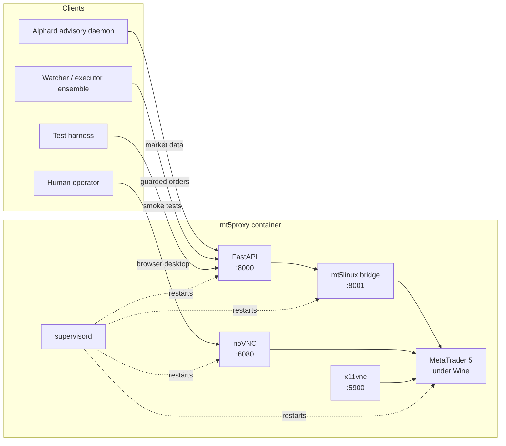
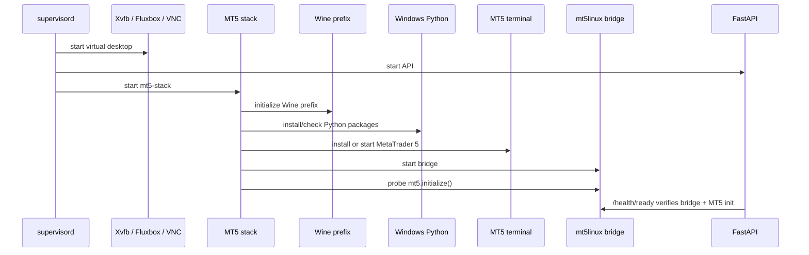
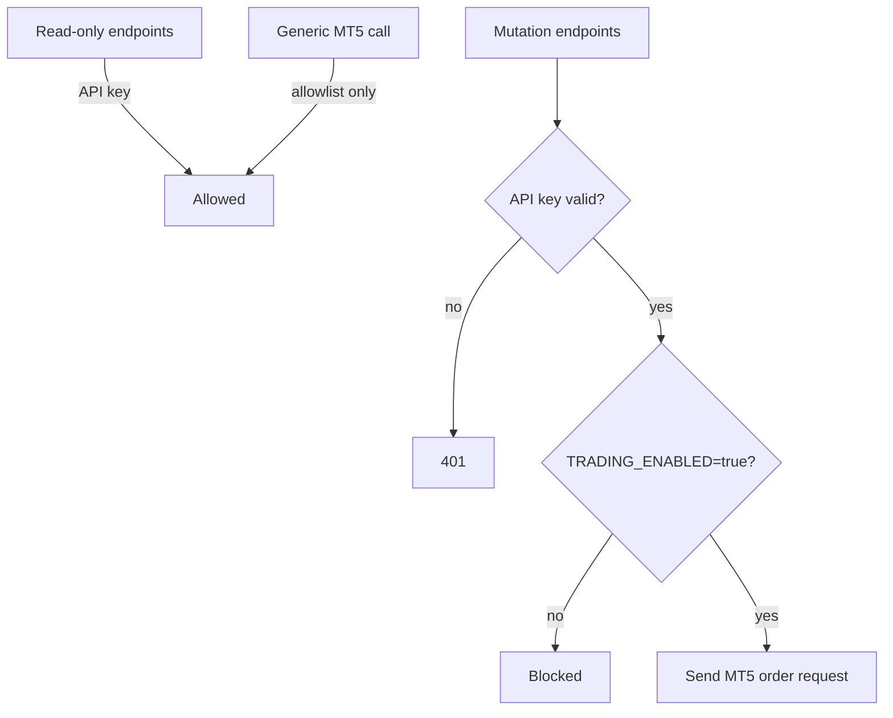

<p align="center">
  <br />
  
</p>

<p align="center">
  <a href="#quick-start"></a>
  <a href="#api-surface"></a>
  <a href="#safety-model"></a>
  <a href="#desktop--debugging"></a>
</p>

<p align="center">
  <b>MT5 Proxy</b> is the infrastructure bridge that lets Alphard and other automation services talk to a real MetaTrader 5 terminal through a stable, auditable HTTP API.
</p>

<p align="center">
  It packages <b>MetaTrader 5 + Wine + mt5linux + noVNC + FastAPI</b> into a single self-healing Docker service.
</p>

---

## Why this exists

MetaTrader 5 is a desktop-first Windows application. Autonomous trading systems, dashboards, and research services want something very different: a small, authenticated, scriptable API that can be deployed close to the broker terminal and called from cloud workloads.

**MT5 Proxy is that adapter.**

It runs MT5 under Wine inside an Ubuntu container, exposes the terminal through a browser-accessible noVNC desktop, starts the Windows-side `mt5linux` bridge, and wraps the useful MT5 operations behind a FastAPI service.

In the broader Alphard architecture, this project is the **market and execution interface**:

```text
Alphard advisory / watcher services
              │
              │  HTTP + X-API-Key
              ▼
┌─────────────────────────────────────┐
│           MT5 Wine Proxy             │
│                                     │
│  FastAPI REST API  ──▶ mt5linux      │
│        ▲                    │        │
│        │                    ▼        │
│     noVNC ◀──────── MetaTrader 5     │
│                                     │
│  Wine + Xvfb + Fluxbox + x11vnc      │
└─────────────────────────────────────┘
              │
              ▼
       Broker / demo account
```

---

## Highlights

- **All-in-one MT5 runtime** — Ubuntu 22.04 image with WineHQ `winehq-staging`, Windows Python, MetaTrader 5, `mt5linux`, noVNC, and FastAPI.
- **Browser inspection** — open the live MT5 terminal in a browser through noVNC.
- **HTTP control plane** — query account state, terminal status, ticks, OHLC bars, positions, pending orders, and selected read-only MT5 calls.
- **Guarded mutation API** — market orders, closes, SL/TP updates, and pending-order operations are blocked unless `TRADING_ENABLED=true`.
- **Readiness that means something** — `/health/ready` does not merely check that a socket is open; it verifies that MT5 can initialize through the bridge.
- **Self-healing process tree** — `supervisord` keeps Xvfb, Fluxbox, x11vnc, noVNC, the API, and the MT5 stack alive.
- **Cloud-friendly defaults** — compose ports bind to `127.0.0.1`, making SSH tunnels the default access pattern on a VM.
- **Smoke-testable** — included tests validate readiness, market data, positions/orders, and optional demo-account mutation flows.

---

## Runtime architecture



### Boot lifecycle



---

## Ports

All compose ports bind to localhost by default.

| Host URL / port | Container | Purpose |
|---|---:|---|
| `http://127.0.0.1:3000/vnc.html` | `6080` | Browser desktop for MT5 inspection |
| `127.0.0.1:5900` | `5900` | Raw VNC for Remmina, TigerVNC, etc. |
| `http://127.0.0.1:8000/health` | `8000` | REST API liveness |
| `http://127.0.0.1:8000/health/ready` | `8000` | Bridge + MT5 initialization readiness |
| `127.0.0.1:8001` | `8001` | `mt5linux` bridge debug port |

---

## Quick start

### 1. Configure

```bash
cp .env.example .env
nano .env
```

Minimal local defaults:

```env
API_KEY=dev-api-key
TRADING_ENABLED=false
MT5_AUTOINSTALL=true
MT5_TEST_SYMBOL=EURUSD
MT5_TEST_VOLUME=0.01
```

Optional auto-login:

```env
MT5_LOGIN=
MT5_PASSWORD=
MT5_SERVER=
```

> Keep `TRADING_ENABLED=false` until the terminal is logged in, readiness passes, and smoke tests have succeeded on a demo account.

### 2. Build and run

```bash
./scripts/local_up.sh
```

Equivalent commands:

```bash
docker compose build
docker compose up -d --remove-orphans
docker compose ps
```

### 3. Open the terminal

```text
http://127.0.0.1:3000/vnc.html
```

Log in to MT5 if it did not auto-login. For demo mutation tests, also enable:

```text
Tools → Options → Expert Advisors → Allow algorithmic trading
```

### 4. Check health

```bash
curl -fsS http://127.0.0.1:8000/health | jq .
curl -fsS http://127.0.0.1:8000/health/ready | jq .
```

### 5. Query status

```bash
curl -fsS \
  -H "X-API-Key: dev-api-key" \
  http://127.0.0.1:8000/v1/status | jq .
```

---

## API surface

Most `/v1/*` endpoints require:

```http
X-API-Key: <API_KEY>
```

Trading endpoints additionally require:

```env
TRADING_ENABLED=true
```

### Health and status

| Method | Endpoint | Auth | Description |
|---|---|---:|---|
| `GET` | `/health` | No | API process liveness |
| `GET` | `/health/live` | No | Liveness probe alias |
| `GET` | `/health/ready` | No | Bridge is listening and MT5 initializes |
| `GET` | `/v1/bridge` | Yes | Bridge, terminal version, terminal info |
| `GET` | `/v1/status` | Yes | Compact terminal, account, trading, and counts |
| `GET` | `/v1/account` | Yes | MT5 account information |

### Market data

| Method | Endpoint | Description |
|---|---|---|
| `GET` | `/v1/symbols/{symbol}/tick` | Symbol metadata and latest bid/ask tick |
| `GET` | `/v1/bars?symbol=EURUSD&timeframe=M1&start=...&end=...` | OHLCV bars with UTC timestamps |
| `POST` | `/v1/mt5/call/{method}` | Read-only escape hatch for approved MT5 Python methods |

Example bars request:

```bash
curl -fsS \
  -H "X-API-Key: dev-api-key" \
  "http://127.0.0.1:8000/v1/bars?symbol=EURUSD&timeframe=M1&start=2026-06-17T06:00:00Z&end=2026-06-17T08:00:00Z" \
  | jq .
```

### Positions and orders

| Method | Endpoint | Description |
|---|---|---|
| `GET` | `/v1/positions?symbol=EURUSD` | Open positions by symbol |
| `GET` | `/v1/positions?ticket=...` | Open position by ticket |
| `GET` | `/v1/orders?symbol=EURUSD` | Pending orders by symbol |
| `GET` | `/v1/orders?ticket=...` | Pending order by ticket |

### Guarded trading endpoints

| Method | Endpoint | Description |
|---|---|---|
| `POST` | `/v1/deals/open` | Open a market position with optional SL/TP |
| `POST` | `/v1/deals/close` | Close a position, optionally verifying it disappeared |
| `POST` | `/v1/positions/{ticket}/sltp` | Set or update position SL/TP |
| `DELETE` | `/v1/positions/{ticket}/sltp` | Remove position SL and/or TP |
| `POST` | `/v1/orders/pending` | Place limit, stop, or stop-limit pending order |
| `POST` | `/v1/orders/{ticket}/modify` | Modify pending price, stop-limit, SL/TP, expiration |
| `DELETE` | `/v1/orders/{ticket}` | Cancel a pending order |

---

## Common flows

### Read status and latest tick

```bash
API_KEY=dev-api-key
BASE_URL=http://127.0.0.1:8000
SYMBOL=EURUSD

curl -fsS -H "X-API-Key: $API_KEY" "$BASE_URL/v1/status" | jq .
curl -fsS -H "X-API-Key: $API_KEY" "$BASE_URL/v1/symbols/$SYMBOL/tick" | jq .
```

### Place, modify, and cancel a pending order

```bash
API_KEY=dev-api-key
BASE_URL=http://127.0.0.1:8000

PLACED=$(curl -fsS -X POST \
  -H "X-API-Key: $API_KEY" \
  -H "Content-Type: application/json" \
  "$BASE_URL/v1/orders/pending" \
  -d '{
    "symbol": "EURUSD",
    "side": "buy",
    "order_kind": "limit",
    "volume": 0.01,
    "price": 1.16016,
    "sl": 1.15725,
    "tp": 1.16225,
    "magic": 424242,
    "type_filling": "AUTO"
  }')

TICKET=$(echo "$PLACED" | jq -r '.result.order')

curl -fsS -X POST \
  -H "X-API-Key: $API_KEY" \
  -H "Content-Type: application/json" \
  "$BASE_URL/v1/orders/$TICKET/modify" \
  -d '{"price": 1.16000, "sl": 1.15700, "tp": 1.16200}' | jq .

curl -fsS -X DELETE \
  -H "X-API-Key: $API_KEY" \
  "$BASE_URL/v1/orders/$TICKET" | jq .
```

### Open and close a small demo position

```bash
# Requires TRADING_ENABLED=true and a demo account.
API_KEY=dev-api-key
BASE_URL=http://127.0.0.1:8000

OPENED=$(curl -fsS -X POST \
  -H "X-API-Key: $API_KEY" \
  -H "Content-Type: application/json" \
  "$BASE_URL/v1/deals/open" \
  -d '{
    "symbol": "EURUSD",
    "side": "buy",
    "volume": 0.01,
    "sl": 1.15923,
    "tp": 1.16223,
    "magic": 424242,
    "type_filling": "AUTO"
  }')

TICKET=$(echo "$OPENED" | jq -r '.result.order')

curl -fsS -X POST \
  -H "X-API-Key: $API_KEY" \
  -H "Content-Type: application/json" \
  "$BASE_URL/v1/deals/close" \
  -d "{\"ticket\": $TICKET, \"verify\": true, \"type_filling\": \"AUTO\"}" | jq .
```

---

## Safety model

This proxy is deliberately designed as a **control point**, not as a strategy engine.



Safety boundaries:

- `/health`, `/health/live`, and `/health/ready` are unauthenticated probes.
- `/v1/*` endpoints require `X-API-Key`.
- The generic `/v1/mt5/call/{method}` endpoint exposes only approved read-only MT5 methods; `order_send` is intentionally kept behind dedicated mutation endpoints.
- Mutation endpoints require both a valid API key and `TRADING_ENABLED=true`.
- Compose binds ports to `127.0.0.1` by default, so production access should happen through SSH tunnels, private VPC networking, or a trusted reverse proxy.
- Always test mutations on a demo account before any live account is connected.

---

## Testing

Run the external smoke suite:

```bash
./tests/run_external_tests.sh
```

The test harness:

1. Creates a local Python virtual environment.
2. Waits for `/health/ready`.
3. Runs read-only checks against the API.
4. Leaves mutation tests disabled unless explicitly requested.

Demo-account mutation test:

```bash
TRADING_ENABLED=true docker compose up -d --force-recreate
PLACE_TRADES=true ./tests/run_external_tests.sh
```

Direct bridge diagnostics from inside the container:

```bash
docker exec -it mt5-proxy-scratch bash

gosu trader bash -lc 'python /opt/mt5proxy/tools/bridge_init_probe.py'
gosu trader bash -lc 'python /opt/mt5proxy/tools/direct_bridge_check.py'
```

---

## Desktop & debugging

Open the desktop:

```text
http://127.0.0.1:3000/vnc.html
```

Follow container logs:

```bash
docker compose logs -f mt5proxy
```

Inspect internal logs:

```bash
docker exec -it mt5-proxy-scratch bash -lc 'ls -lh /logs && tail -100 /logs/bridge-init.log'
```

Useful log files:

```text
/logs/supervisord.log
/logs/mt5-stack.supervisor.log
/logs/wine-python-install.log
/logs/mt5-install.log
/logs/mt5-terminal.log
/logs/mt5-bridge.log
/logs/bridge-init.log
/logs/api.supervisor.log
```

Manual debug commands:

```bash
docker exec -it mt5-proxy-scratch bash

gosu trader bash -lc 'wine_sanity.sh'
gosu trader bash -lc 'install_wine_python.sh'
gosu trader bash -lc 'start_mt5.sh'
gosu trader bash -lc 'start_bridge.sh'
```

Normal boot should not need these commands; they are kept for targeted diagnosis.

---

## Cloud deployment notes

The default compose configuration is suitable for a VM that is reached through SSH tunnels.

```bash
gcloud compute ssh YOUR_VM --zone YOUR_ZONE -- \
  -L 3000:127.0.0.1:3000 \
  -L 8000:127.0.0.1:8000
```

Open locally:

```text
http://127.0.0.1:3000/vnc.html
http://127.0.0.1:8000/health
```

When pairing with Alphard on another VM in the same VPC, use the MT5 proxy VM's internal IP:

```bash
curl -fsS http://MT5_PROXY_INTERNAL_IP:8000/health
curl -fsS http://MT5_PROXY_INTERNAL_IP:8000/health/ready
curl -fsS -H "X-API-Key: <strong-key>" http://MT5_PROXY_INTERNAL_IP:8000/v1/status
```

Recommended production posture:

- Keep noVNC and raw VNC off the public internet.
- Use a long random `API_KEY`.
- Restrict inbound access with VPC firewall rules.
- Keep `TRADING_ENABLED=false` unless an executor is deliberately allowed to mutate state.
- Prefer demo validation and smoke tests before switching any downstream system to live mode.

---

## Environment variables

| Variable | Default | Description |
|---|---|---|
| `BASE_IMAGE` | `ubuntu:22.04` | Docker base image |
| `WINEHQ_UBUNTU_CODENAME` | `jammy` | WineHQ Ubuntu repository codename |
| `WINEHQ_PACKAGE` | `winehq-staging` | WineHQ package to install |
| `API_KEY` | `dev-api-key` | Required for `/v1/*` endpoints |
| `TRADING_ENABLED` | `false` | Enables mutation/trading endpoints when true |
| `VNC_PASSWORD` | empty | Optional raw VNC/noVNC password |
| `SCREEN_WIDTH` | `1280` | Virtual desktop width |
| `SCREEN_HEIGHT` | `900` | Virtual desktop height |
| `MT5_AUTOINSTALL` | `true` | Try MT5 installer `/auto` during boot |
| `MT5_SETUP_URL` | MetaQuotes installer URL | MT5 installer source |
| `MT5_LOGIN` | empty | Optional account login for `mt5.initialize()` |
| `MT5_PASSWORD` | empty | Optional account password |
| `MT5_SERVER` | empty | Optional broker server |
| `MT5LINUX_HOST` | `127.0.0.1` | Bridge host inside the container |
| `MT5LINUX_PORT` | `8001` | Bridge port |
| `MT5LINUX_TIMEOUT` | `300` | Bridge client timeout seconds |
| `MT5_TIMEOUT_MS` | `60000` | MT5 initialize timeout |
| `READY_MT5_TIMEOUT_MS` | `15000` | Timeout used by `/health/ready` |
| `BRIDGE_INIT_RETRY_SECONDS` | `60` | Retry cadence for bridge init probing |
| `BRIDGE_INIT_TIMEOUT_SECONDS` | `120` | Per-attempt bridge init timeout |
| `MT5_TEST_SYMBOL` | `EURUSD` | Smoke-test symbol |
| `MT5_TEST_VOLUME` | `0.01` | Smoke-test volume |

---

## Resetting local state

When switching Wine builds or recovering from a broken local Wine prefix:

```bash
./scripts/local_reset.sh
./scripts/local_up.sh
./tests/run_external_tests.sh
```

This removes the local `/config` and `/logs` named volumes. Do **not** run it on a VM where the MT5 login/profile must be preserved unless that state has been backed up.

---

## Implementation notes

The image intentionally avoids opaque third-party MT5/VNC base images. It builds a controlled stack with:

- WineHQ Ubuntu `jammy` packages.
- Windows Python `3.9.13`.
- Pinned Windows-side bridge packages: `MetaTrader5==5.0.36`, `mt5linux==1.0.3`, `rpyc==6.0.2`, `numpy==1.26.4`.
- `supervisord` as the process supervisor.
- FastAPI as the stable REST façade.
- Named Docker volumes for persistent `/config` and `/logs`.

If Wine services fail under the default `seccomp=unconfined` setting, a privileged compose override exists as a last-resort debugging option:

```bash
docker compose -f docker-compose.yml -f docker-compose.privileged.yml up -d --force-recreate
```

Use privileged mode only when necessary.

---

## Repository map

```text
.
├── app/mt5_proxy/main.py          # FastAPI app and MT5 endpoint handlers
├── docker-compose.yml             # Localhost-bound service definition
├── docker-compose.privileged.yml  # Last-resort privileged override
├── docs/api.md                    # Full endpoint contract and examples
├── scripts/local_up.sh            # Local build + run helper
├── scripts/local_reset.sh         # Local Docker volume reset helper
├── tests/run_external_tests.sh    # End-to-end API smoke test runner
├── tests/test_ep.py               # External endpoint flow tests
├── tests/wait_for_api.py          # Health/readiness waiter
└── tools/                         # Bridge probes and diagnostics
```

---

## Troubleshooting

| Symptom | Check |
|---|---|
| `/health` fails | API process or container is not running. Check `docker compose ps` and `/logs/api.supervisor.log`. |
| `/health/ready` fails | Bridge socket may be down, MT5 may not be started, or `mt5.initialize()` failed. Check `/logs/bridge-init.log` and `/logs/mt5-terminal.log`. |
| noVNC opens but MT5 is not logged in | Log in manually through the browser desktop or provide `MT5_LOGIN`, `MT5_PASSWORD`, and `MT5_SERVER`. |
| `/v1/*` returns `401` | Missing or incorrect `X-API-Key`. |
| Trading endpoint returns `TRADING_ENABLED=false` | Set `TRADING_ENABLED=true` and recreate the container only after demo validation. |
| Orders rejected with filling errors | Try `type_filling=AUTO` so the proxy can attempt supported filling modes. |
| Broken Wine prefix after rebuild | Run `./scripts/local_reset.sh` locally, then rebuild. |

---

## Role in Alphard

Alphard should treat this service as the **MT5 boundary**:

```text
MT5 Proxy owns: terminal state, market data, positions, orders, and broker API calls.
Alphard owns: analysis, recommendations, watcher validation, risk gates, and audit artifacts.
```

That separation keeps the trading pipeline understandable: the proxy exposes what MT5 can do, while downstream systems decide when — or whether — any action is justified.

---

<p align="center">
  <b>MT5 Proxy turns a desktop trading terminal into a cloud-native control surface.</b>
  <br />
  Observable by humans. Scriptable by systems. Guarded by default.
</p>
